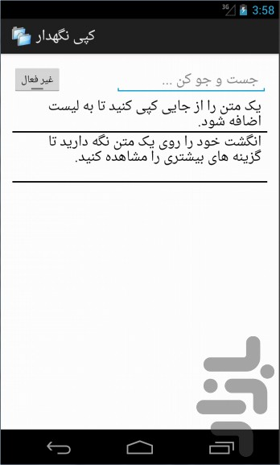
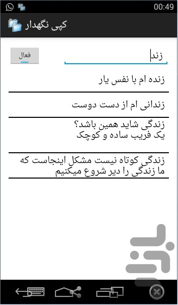
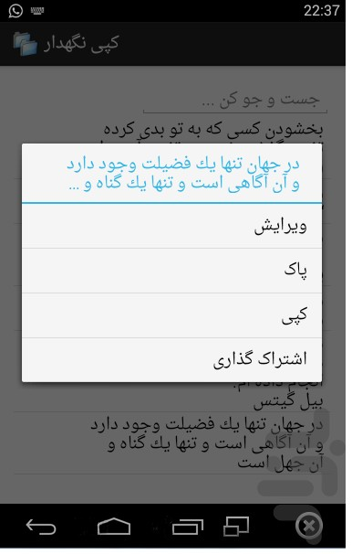
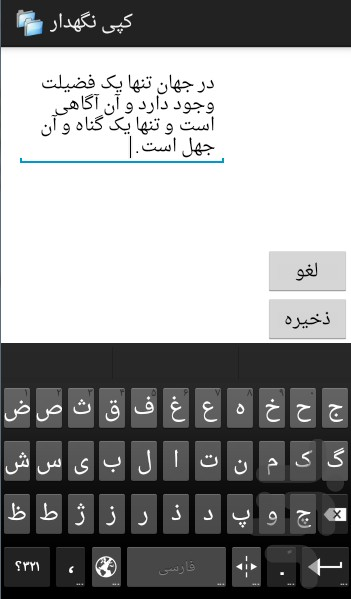
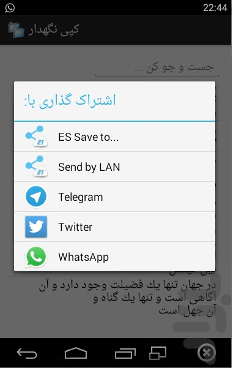

# Copy Holder

Copy Holder is a legacy Android application that saves and manages clipboard text snippets. It was originally created as a personal Android project more than 10 years ago and is now maintained as a GitHub portfolio repository.

## Project Status

This repository is preserved as a historical portfolio project. The code reflects the Android development practices and APIs used at the time it was built, including a legacy Android/Eclipse-style project layout.

The app is not currently modernized for recent Android versions. Modern Android privacy restrictions may limit or prevent background clipboard monitoring.

## Features

- Save copied text snippets into a local history list.
- Search saved clipboard entries.
- Edit existing entries.
- Delete unwanted entries.
- Copy saved entries back to the clipboard.
- Share saved text through Android's share sheet.
- Store entries locally using SQLite.

## Tech Stack

- Java
- Android SDK
- Legacy Android Support Library
- SQLite
- Android XML layouts and resources
- Eclipse/ADT-style Android project structure

## Screenshots

Screenshots are available under `docs/screenshots/`.

| Main screen | Search | Entry actions |
| --- | --- | --- |
|  |  |  |

| Edit entry | Copy/share workflow |
| --- | --- |
|  |  |

## Installation

### Clone the repository

```bash
git clone https://github.com/vahidom/Copy-Holder.git
cd Copy-Holder
```

### Build notes

This is a legacy Android project, not a modern Gradle project. The original project structure expects:

- Android SDK tooling compatible with Eclipse/ADT-era projects.
- Android target configuration from `project.properties`.
- Legacy Android Support Library dependencies.

Modern Android Studio may require migration to Gradle and AndroidX before the project builds cleanly.

### Optional APK installation

The repository currently contains historical build artifacts from the original project. If using the included legacy APK for archival inspection:

```bash
adb install bin/Copyholder.apk
```

Use this only for local testing on a suitable legacy/emulator environment.

## Usage

1. Open the app.
2. Enable clipboard monitoring from the main screen.
3. Copy text in Android.
4. Return to Copy Holder to view saved clipboard entries.
5. Long-press an entry to edit, delete, copy, or share it.
6. Use the search field to filter saved entries.

## Project Structure

```text
Copy-Holder/
  AndroidManifest.xml        Legacy Android manifest
  src/                       Java source code
  res/                       Android layouts, strings, styles, and drawables
  assets/copydata            Prebuilt SQLite database asset
  libs/                      Legacy vendored support library JARs
  project.properties         Eclipse/ADT Android project configuration
  proguard-project.txt       Legacy ProGuard configuration placeholder
  docs/                      Portfolio documentation and project context
  bin/, gen/                 Historical generated build artifacts
```

## Documentation

- [Project Context](docs/PROJECT_CONTEXT.md)
- [Architecture Overview](docs/ARCHITECTURE.md)
- [Modernization Roadmap](docs/MODERNIZATION_ROADMAP.md)
- [Security Policy](SECURITY.md)
- [Changelog](CHANGELOG.md)

## Notes for Recruiters

This repository demonstrates an early Android application built with Java, SQLite, Android services, and native Android UI resources. It is intentionally presented as a legacy project, with documentation describing both the original implementation and how it could be modernized today.

## License

This project is licensed under the MIT License. See [LICENSE](LICENSE) for details.
